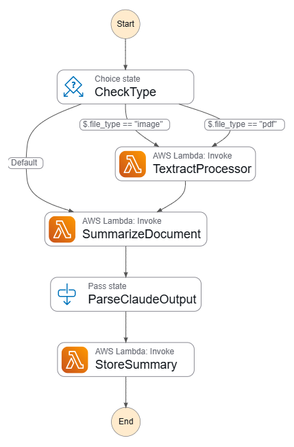

# 📄 Intelligent Document Summarization on AWS (Serverless Architecture)

This project delivers an end-to-end **serverless application** designed to process, extract, and summarize documents uploaded by users. Built entirely with **AWS managed services**, the system takes in various file formats (PDF, Image, Text), intelligently extracts content, generates summaries using **Bedrock Claude**, and returns the result—all without any server management.


> 🧠 A powerful blend of **Lambda**, **API Gateway**, **Step Functions**, **Textract**, **Bedrock Claude**, and **EventBridge** makes this pipeline robust, scalable, and intelligent.

---

## 🧾 Use Case

> "Users can upload documents through a website hosted on S3. The system processes the files using a series of AWS Lambda functions orchestrated via Step Functions. It extracts content, generates summaries using Claude (Bedrock), stores the result in S3, and notifies the user via EventBridge."

---

## 🌐 End-to-End Workflow

1. **User uploads** a file (PDF/Image/Text) via a web application hosted on **Amazon S3**.
2. The upload request is sent through **Amazon API Gateway** to a **Lambda function** (`upload handler`).
3. The file is stored in the **S3 input bucket** and a **Step Function** is triggered.
4. The **Step Function** coordinates three Lambda functions:

   * `extract processor`: uses **Textract** to extract text.
   * `summarize document`: uses **Bedrock Claude** to summarize content.
   * `store summary`: saves the summary to the **output S3 bucket**.
5. **Amazon EventBridge** detects the summary stored in S3 and **triggers a retrieval** process to deliver the output back to the user interface.

---

## 🧩 Component-wise Breakdown

Each component's name directly reflects its role in the architecture.

### 🧍‍♂️ **User Upload**

* The user uploads a document (PDF, image, or text) through a static site.
* ✅ Simple and intuitive interface.
* ✅ Triggers a secure API call to begin processing.

---

### 🟩 **Frontend (Hosted on S3)**

* Static web app hosted in an S3 bucket.
* Contains HTML, CSS, and JavaScript for upload and summary UI.
* Integrated with **API Gateway** for file submission.

---

### 🟪 **API Gateway**

* Acts as a secure entry point for incoming HTTP requests.
* Triggers the backend `upload handler` Lambda function.

---

### 🟧 **upload handler (Lambda)**

* Receives the file from API Gateway.
* Uploads it to the **Input Files S3 Bucket**.
* Initiates the **Step Function execution** to begin processing.

---

### 🟪 **Step Function** 




* Manages and sequences the execution of document processing logic.
* Ensures that each stage completes before the next begins.
* Provides monitoring, retries, and error handling.

Flow inside the Step Function:

1. `Textract processor`
2. `Summarize document`
3. `Store summary`

---

### 🟧 **Textract processor (Lambda)**

* Fetches the uploaded file from S3.
* Invokes **Textract** to extract readable text from PDFs, scanned images, or documents.
* Returns structured text for further processing.

---

### 🟩 **Textract**

* Extracts printed text and data from scanned documents.
* Especially useful for PDFs, images, and handwritten forms.

---

### 🟧 **Summarize Document (Lambda)**

* Receives extracted text.
* Sends it to **Claude via Bedrock** to create a coherent, concise summary.
* Supports semantic understanding and natural language generation.

---

### 🟩 **Bedrock (Claude)**

* An LLM (Large Language Model) by Anthropic.
* Accessed via AWS Bedrock to generate AI-based summaries from textual input.
* Ensures fluent, accurate, and context-aware results.

---

### 🟧 **Store Summary (Lambda)**

* Saves the generated summary to the **Output Files S3 Bucket**.
* Ensures each summary is uniquely identifiable and retrievable.

---

### 🟩 **Output Files (S3 Bucket)**

* Stores the final summary outputs.
* Structured to allow user-specific or timestamped access.

---

### 🟥 **EventBridge**

* Monitors the Output Files S3 bucket for new summaries.
* Upon detecting a new summary file, it:

  * Triggers the retrieval mechanism to make the result available to the user UI.
  * Enables real-time feedback and delivery for users.

---

## 🧠 Real-World Applications

| Industry       | Use Case                               |
| -------------- | -------------------------------------- |
| Legal          | Summarize contracts and legal files    |
| Healthcare     | Condense patient reports and histories |
| Finance        | Abstract financial reports             |
| HR/Recruitment | Summarize resumes or applications      |
| Education      | Summarize academic papers              |

---

## 🔧 Services Used

| Service              | Role                                         |
| -------------------- | -------------------------------------------- |
| **S3**               | Hosts frontend and stores input/output files |
| **API Gateway**      | Connects frontend to backend securely        |
| **Lambda**           | Serverless compute for all logic             |
| **Step Functions**   | Orchestrates multi-step workflows            |
| **Textract**         | Extracts text from documents                 |
| **Bedrock (Claude)** | Generates summaries using generative AI      |
| **EventBridge**      | Monitors output bucket & triggers retrieval  |

---

## 📁 Suggested Project Structure

```
📁 frontend/
   ├── index.html

📁 lambdas/
   ├── upload_handler.py
   ├── Textract_processor.py
   ├── summarize_document.py
   └── store_summary.py

📁 state-machine/
   └── step_function_definition.json

📁 eventbridge/
   └── rule.json

📁 s3/
   └── bucket_configurations/
```

---

## ✅ Key Highlights

* ⚡ **100% serverless** – no servers to manage.
* 📄 Supports multiple file formats (PDF, image, text).
* 🔁 Auto-processing and real-time summarization.
* 🧠 AI-powered insights via Claude (Bedrock).
* 📬 Real-time delivery using EventBridge notifications.

---

## 📌 Final Thoughts

This project demonstrates the potential of **AI + Serverless** on AWS. By combining event-driven workflows, intelligent text extraction, and AI-powered summarization, this system is both robust and intelligent. It’s a future-ready solution suitable for any business that deals with document overload.

> **Ready to scale. Ready to simplify. Ready for the cloud.**


